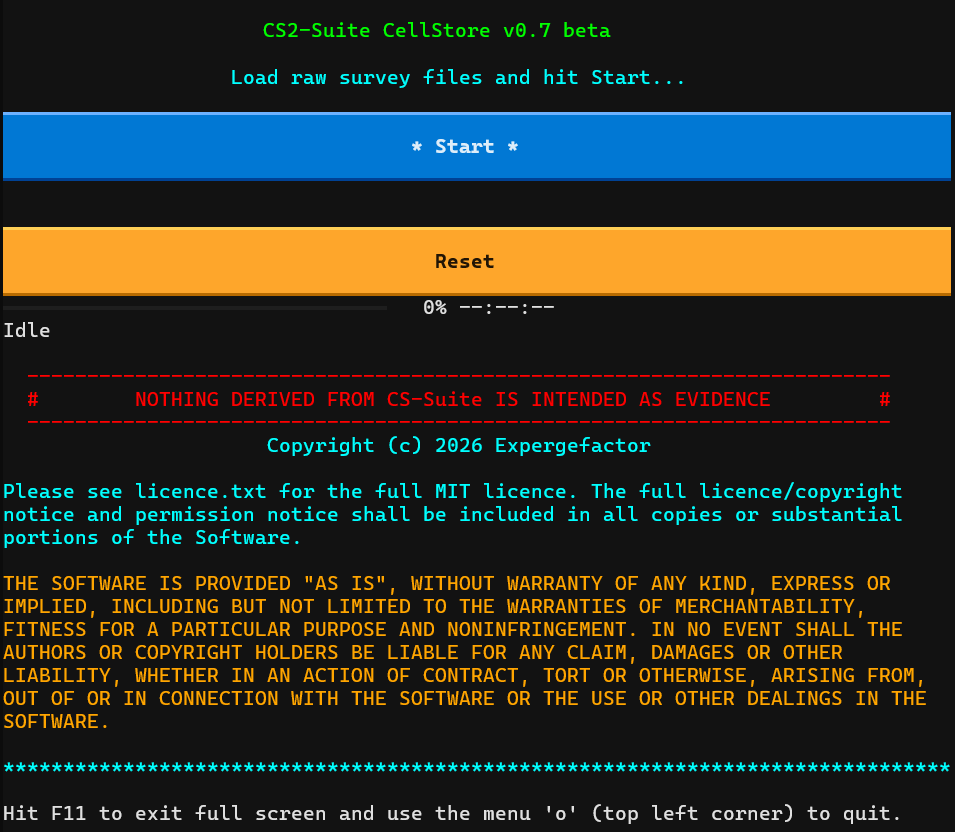
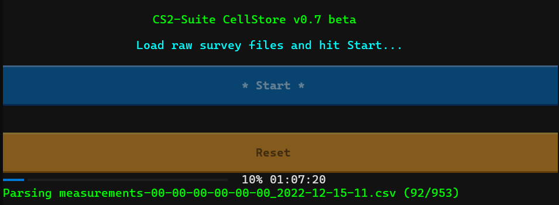
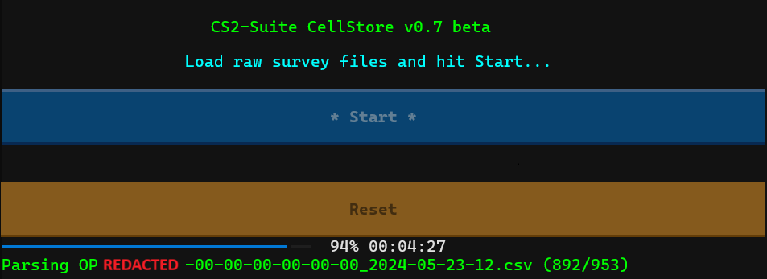

# CS²-Suite Overview

_CS²-Suite_ is a Windows11 RTE workflow comprising of two complimentary applications: _CellStore_ and _CellSearch_. It is a private endeavour & has no affiliation with any commercial service.

_CellStore_ is a data management system, converting raw Group2000 LimaCM data into a compact 'serving cell'  database. _CellSearch_ will be a _CellStore_ query utility providing clinical mapping of _CellStore_ data. Its overall purpose is to answer fundamental questions: has this cell been measured before and, if so, where and when?

Whether you need to know instantly or, you're simply researching a missing cell, the _CS²-Suite_ instantly unlocks tens-of-millions of otherwise untapped measurments. Backfill missing data for your casework, paint that intelligence picture without leaving your desk, locate those devices that need finding! With the _CS²-Suite_ in your corner, you’re empowered to make rapid, dynamic interpretations to inform those critical operational decisions.

_CS²-SUITE_ IS A CAPABILITY ENHANCEMENT TOOL. NOTHING DERIVED FROM _CS²-SUITE_ IS INTENDED AS EVIDENCE. _CS²-SUITE_ WILL POINT YOU IN THE DIRECTION OF ORIGINAL SOURCE DATA WHICH SHOULD ALWAYS BE RETAINED FOR EVIDENTIAL USE IN ACCORDANCE WITH YOUR STANDARD PROCEDURES.

# _CellStore_ offers:
* Rapid leverage from tens-of-millions of cell measurements.
* Pivot survey data to critical incident intelligence – like similar cell intelligence products but with CS²-Suite, you know where the data has come from. Even better, it’s free!
* Lightweight, simple, and easy to use.
* No installation, no registry changes, no admin rights required.
* Self-contained environment – run directly from an external, encrypted hard drive (or not, you choose).
* Extremely rapid parsing – GB of raw data, millions of cell measurements, in minutes.
* Demonstrable robust file integrity – timestamped SHA-256 file management – when you need that data back, a quick re-hash is all you need to know that it’s exactly how you put it in.
* De-duplication logic prevents the same data being duplicated.
* Continually build your database over time by adding more and more survey data.
* Informative per-file process logging – letting you know what happened with every file.
* Statistical summary – marvel at what you've achieved!
* Easy to reproduce if it all goes wrong for whatever reason.
* Built by someone-who-uses-the-kit for people-who-use-the-kit!

# Performance:

An average survey spanning several hours can fully parse in under 20 seconds, a few years worth of data within minutes. For example, 3 years totalling 953 files and over 21GB of data (over 89 million rows!) was parsed in 1 hour and 1 minute drung beta testing. The result: a serving cell database just over 2GB in size (just under 10% of original size) containing over 19 million valid serving cell records. All this while running on inexpensive hardware and entirely from an encrypted external SSD. 

# (Roadmap) _CellSearch_ will offer:
* Search by Cell ID - as many as you can handle, as often as you can take it.
* Mapped output of all matching cell measurements – but not so much to allow sloppy process shortcuts (sorry!).
* Clickable cell-points – click a dot to see all vital cell information and the date, time and hash for the file the data come from.
* Identifiable date range per cell – surveyed the same cell on different days? I got you covered!
* Signpost back to where you can find the original data for evidential use. 

# Too good to be true, right? What’s the catch?
Nope! I made this for me but I'm all for making friends and doing things ‘smarter’. OK, some bugs may grow as they chew through the database. I’ll deal with things as they happen. This doesn’t replace anything you already have, it compliments it. And, it’s not often you get something for free!

No data is (or ever will be) collected. With an authorised copy, the source-code will be human readable for your reassurance. If it’s not, it’s not come from me. Your data is yours and no-one else's! Who you share it with is up to you (but please consider helping me out if, on an extremely rare occasion, I come asking on official business). 

_CS²-Suite_ is not publicly available but (I hope) to make it available free of charge to UK Law Enforcement under MIT licence terms. Heck, further development may open the playing field. If it helps prevent harm, protect the public, and aids justice it’s all good.

Although not yet pursued, _CS²-Suite_ has potential to leverage data from other RF survey tools. If you have one and are giving _CS²-Suite_ an envious eye, get in touch. It’s good to talk! For enquiries, please contact me using your professional email (Law Enforcement and professional partners only please).
