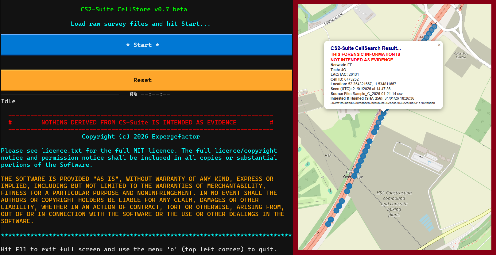
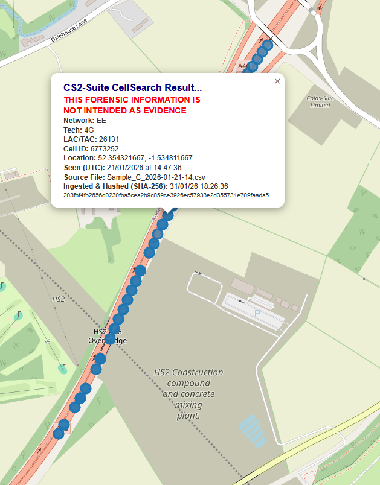

# CS²-Suite Overview

_CS²-Suite_ is a Windows11 RTE workflow comprising of two complimentary applications: _CellStore_ and _CellSearch_. It is a private endeavour & has no endorsement from any organisation or affiliation with any commercial enterprise.

_CellStore_ is a data management system, converting raw Group2000 LimaCM data into a compact 'serving cell'  database. _CellSearch_ is a _CellStore_ query utility providing clinical mapping of _CellStore_ data. Its overall purpose is to answer fundamental questions: has this cell been measured before and, if so, where? when? Where is the source file?

From rapid access to a cell's known service area to researching a missing 3G cell, the _CS²-Suite_ instantly unlocks tens-of-millions of otherwise untapped measurments. Backfill missing data for your casework, paint that intelligence picture without leaving your desk, locate those devices that need finding! With the _CS²-Suite_ in your corner, you’re empowered to make rapid, dynamic interpretations to inform those critical operational decisions. 

# _CellStore_ offers:
* Rapid leverage from tens-of-millions of cell measurements.
* Pivot survey data to critical incident intelligence – like similar cell intelligence products but with CS²-Suite, you know where the data has come from. Even better, it’s free!
* Lightweight, simple, and easy to use.
* No installation, no registry changes, no admin rights required.
* Self-contained environment – run directly from an external, encrypted hard drive (or not, you choose).
* Extremely rapid parsing – GB of raw data, millions of cell measurements, in minutes.
* Demonstrable robust file integrity – timestamped SHA-256 file management – when you need that data back, a quick re-hash is all you need to know that it’s exactly how you put it in.
* De-duplication logic prevents the same data being duplicated.
* Continually build your database over time by adding more and more survey data.
* Informative per-file process logging – letting you know what happened with every file.
* Statistical summary – marvel at what you've achieved!
* Easy to reproduce if it all goes wrong for whatever reason.
* Built by someone-who-uses-the-kit for people-who-use-the-kit!

# _CellSearch_ offers:
* Search by Cell ID - more than one? You can do it! String 'em together. As many as you like, as often as you can take it. Stress tested with a string of 40, if you get it to break, let me know.
* Interactive maps - all critical cell data embedded - results instantly at your fingertips! Currently limited to 50,000 points per map, we'll see how that goes.
* Launch maps with your system's default browser. No add-ons, no plug-ins, nothing to install. Internet connection required for OpenStreetMap tile - cell data never leaves your machine!

* Clickable cell-points – all vital cell information at the click of a button!
* Same cell on different days? _CellSearch_ has your 6! A selection of 20 pretty dot colours makes this abundanlty clear. Click the dots to see when the measurement was taken!
* Just enought to be useful, not quite enough to enable sloppy working practices - signpost back to where you can find the original data for operational use - date, time and file hash right there with the cell information. Now you know what you've got, go and deal with it properly in your usual way.
* No need to click every dot, comprehensive logging gives you the information you need to gig out the original data, all in a small text file. 

# Performance:

An average survey spanning several hours can fully parse in under 20 seconds, a few years worth of data within minutes. For example, 3 years totalling 953 files and over 21GB of data (over 89 million rows!) was parsed in 61 minutes during testing. The result: a serving cell database just under 10% of original size containing over 19 million valid serving cell records. All this while running on inexpensive hardware and entirely from an encrypted external SSD. 

During stress testing of _CellSearch_ with sample data, a 40-cell string query (40 cell IDs separated by a comma) resulted in 2160 measurments plotted and written to 40 maps in 1 second. Need to query more in a single hit? Let me know if you break it!

# Too good to be true, right? What’s the catch?
Nope! I made this for myself, my team, my organisation and for the public good. _CS2-Suite's_ success will (hopefully) be my reward. If I learn of other success too, what can be better than that? Go Team LE! On a serious note, please feed back success stories!

No data is (or ever will be) collected. With an authorised copy, the source-code will be human readable for your reassurance. If it’s not, it’s not come from me. Your data is yours and no-one else's! Who you share it with is up to you. 

_CS²-Suite_ will not be publicly available. I plan to make it available free of charge to UK Law Enforcement RF teams under MIT licence terms. You'll need your own stand-alone machine but for any enquiries, simply contact me using your professional email (Law Enforcement only). I'm an advocate of collaboration, if you have any suggestions, I'm all ears. Further development may open the playing field. If it helps prevent harm, protects the public, and aids justice, it’s all good.

The Group200 LimaCM is available around the globe including the USA, Canada, UK, Australia, and New Zealand. If you have one and are giving _CS²-Suite_ a curious eye, you're welcome to get in touch. It’s good to talk! _CS²-Suite_ also has potential to leverage data from other RF survey tools. If you think this would be useful to use with your tool(s), you know the drill!

Please understand, I am but one person juggling a busy life. Unexpected bugs may grow if they gestate and nibble away. If you spot any give 'em a squish or point me in their direction - I’ll deal with them. 

Remember, _CS-Suite_ doesn’t replace anything you already have, it just unlocks potential and empowers you to do more.

# Disclaimer...

_CS²-SUITE_ IS A CAPABILITY ENHANCEMENT TOOL ONLY, NOTHING MORE. DUE DILIGENCE IS ESSENTIAL! _CS2-SUITE_ DOES NOT, NOR DOES IT SEEK TO, CIRCUMVENT  YOUR STANDARD OPERATING PROCEDURES. ALWAYS CHECK _CELLSEARCH_ RESULTS AGAINST ORIGINAL DATA  USING OFFICIAL ANALYTICAL TOOLS BEFORE TAKING ANY REAL-WORLD ACTION. THE AUTHOR WILL NOT BE LIABLE FOR FAILURES TO ADHERE TO THIS ADVICE. NOTHING DERIVED FROM _CS²-SUITE_ IS INTENDED AS EVIDENCE. _CS²-SUITE_ WILL POINT YOU IN THE DIRECTION OF ORIGINAL SOURCE DATA WHICH MUST ALWAYS BE USED AS EVIDENCE OR WHERE REAL-WORLD CONSEQUENCES MAY ARISE.

**********
